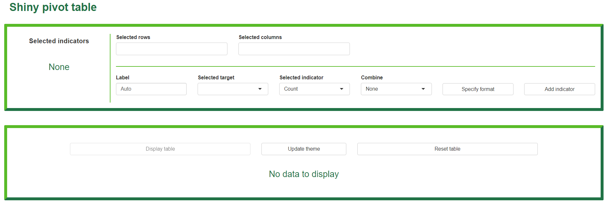
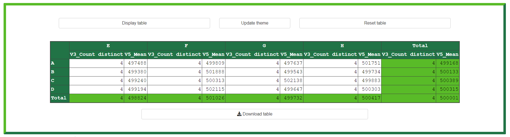
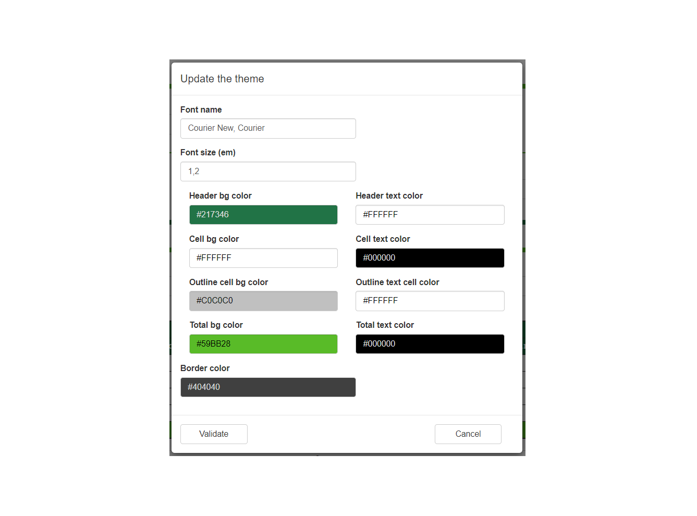

[](https://CRAN.R-project.org/package=shinypivottabler)
[](https://CRAN.R-project.org/package=shinypivottabler)
[](https://cranchecks.info/pkgs/shinypivottabler)
[](https://www.repostatus.org/#active)

# shinypivottabler

The great [``pivottabler``](http://www.pivottabler.org.uk/index.html) package enables pivot tables to be created with just a few lines of R.

The `pivottabler` package aims to:

-   Provide an easy way of creating pivot tables, without requiring the user to specify low-level layout logic.
-   Provide multiple ways of specifying calculation logic to cover both simple and more sophisticated requirements.
-   Provide styling options so the pivot tables can be themed/branded as needed.

**All calculations for the pivot tables take place inside R, enabling the use of a wide-range of R functions in the calculation logic, and are optimized with the use of packages dplyr & data.table**

`shinypivottabler` just adds a simple and useful Shiny module to build, visualize, customize and export custom pivot tables.

### shinypivottabler vs rpivotTable ?


The [``rpivotTable``](https://github.com/smartinsightsfromdata/rpivotTable) package is visualization library built around the Javascript [pivottable](https://pivottable.js.org/examples/) library.

``PivotTable.js`` is a Javascript Pivot Table library with drag'n'drop functionality built on top of jQuery/jQueryUI and  written in CoffeeScript  (then compiled to JavaScript) by Nicolas Kruchten at Datacratic. It is available under an MIT license

``rpivotTable`` is really a great pivot table library with some really cool features such as : 

- drag'n' drop table definition
- lot of available aggregators
- possibility to print interactive charts

But it's a full *Javascript* tool, and so all the data are sended to the client, and all computations are done on the client. So it's not a good idea to use ``rpivotTable`` with a huge database.

No charts (yet...?) in `shinypivottabler` but : 

- a full efficient **R** tool, on server-side
- possibility to add new aggregate functions
- possibility to combine two indicators
- output customization and excel export

### Installation

You can install:

-   the latest development version from GitHub with

``` r
devtools::install_github("datastorm-open/shinypivottabler")
```

### Demo application

``` r
runApp(system.file("demo_app", package = "shinypivottabler"))
```

### Example

``` r
require(shinypivottabler)

n <- 10000000

# create artificial dataset
data <- data.frame("gr1" = sample(c("A", "B", "C", "D"), size = n,
                                 prob = rep(1, 4), replace = T),
                   "gr2" = sample(c("E", "F", "G", "H"), size = n,
                                 prob = rep(1, 4), replace = T),
                   "gr3" = sample(c("I", "J", "K", "L"), size = n,
                                 prob = rep(1, 4), replace = T),
                   "gr4" = sample(c("M", "N", "O", "P"), size = n,
                                 prob = rep(1, 4), replace = T),
                   "value1" = rnorm(n),
                   "value2" = runif(n))


server = function(input, output, session) {
  shiny::callModule(module = shinypivottabler,
                    id = "id",
                    data = data,
                    pivot_cols = c("gr1", "gr2", "gr3", "gr4"))
}

ui = shiny::fluidPage(
  shinypivottablerUI(id = "id")
)

shiny::shinyApp(ui = ui, server = server)


# more info in documentation : 
?shinypivottabler
```

- Define your pivot table



- Visualize & export



- Customize


